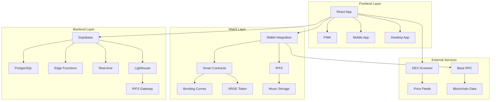

# 🏗️ System Architecture Overview

ROUGEE.PLAY is built as a modern, decentralized music platform that combines traditional web technologies with Web3 infrastructure to create a unique music trading ecosystem.

## 🎯 Architecture Principles

### 1. **Decentralized by Design**
- Music stored on IPFS (InterPlanetary File System)
- Smart contracts handle trading logic
- No single point of failure
- Censorship-resistant platform

### 2. **User-Centric Experience**
- Fast, responsive web interface
- Mobile-first design
- Offline-capable PWA
- Intuitive navigation

### 3. **Scalable Infrastructure**
- Microservices architecture
- Edge computing for global performance
- Caching strategies for optimal speed
- Database optimization

## 🏛️ High-Level Architecture



## 🔧 Technology Stack

### Frontend Layer
- **React 18** - Modern UI library with concurrent features
- **TypeScript** - Type-safe development
- **Vite** - Lightning-fast build tool
- **Tailwind CSS** - Utility-first styling
- **shadcn/ui** - Beautiful component library

### Web3 Layer
- **wagmi** - React hooks for Ethereum
- **viem** - TypeScript interface for Ethereum
- **Web3Modal** - Multi-wallet connection
- **IPFS** - Decentralized file storage
- **Smart Contracts** - Trading and revenue logic

### Backend Layer
- **Supabase** - Backend-as-a-Service
- **PostgreSQL** - Relational database
- **Edge Functions** - Serverless compute
- **Row-Level Security** - Data protection
- **Real-time** - Live updates

### Infrastructure
- **Netlify** - Hosting and CDN
- **Lighthouse** - IPFS pinning service
- **Base Network** - Primary blockchain
- **Ethereum** - XRGE token network

## 📊 Data Flow Architecture

### 1. **Music Upload Flow**
```
User Upload → Lighthouse → IPFS → Smart Contract → Database
```

### 2. **Trading Flow**
```
User Trade → Smart Contract → Blockchain → Real-time Update → UI
```

### 3. **Streaming Flow**
```
User Play → IPFS Gateway → CDN → Browser → Audio Player
```

### 4. **Social Flow**
```
User Action → Edge Function → Database → Real-time → All Users
```

## 🗄️ Database Architecture

### Core Tables

#### **profiles**
```sql
- id: uuid (primary key)
- wallet_address: text (unique)
- artist_name: text
- bio: text
- avatar_url: text
- cover_url: text
- social_links: jsonb
- total_songs: integer
- total_plays: bigint
- created_at: timestamp
- updated_at: timestamp
```

#### **songs**
```sql
- id: uuid (primary key)
- artist_id: uuid (foreign key)
- title: text
- description: text
- genre: text
- ipfs_hash: text
- token_address: text
- bonding_curve_address: text
- total_supply: bigint
- tokens_sold: bigint
- xrge_raised: numeric
- play_count: bigint
- created_at: timestamp
```

#### **stories**
```sql
- id: uuid (primary key)
- artist_id: uuid (foreign key)
- content: text
- media_url: text
- expires_at: timestamp
- created_at: timestamp
```

#### **comments**
```sql
- id: uuid (primary key)
- song_id: uuid (foreign key)
- user_id: uuid (foreign key)
- content: text
- created_at: timestamp
```

### Security Model

#### **Row-Level Security (RLS)**
- **Public Read**: All users can read profiles, songs, comments
- **Authenticated Write**: Users can only modify their own data
- **Admin Override**: Admins can moderate content

#### **Edge Function Security**
- **JWT Validation**: All requests validated with Privy JWT
- **Wallet Verification**: Blockchain signature verification
- **Rate Limiting**: Prevent abuse and spam

## 🔐 Security Architecture

### 1. **Authentication Layer**
```
Wallet Connection → JWT Token → Edge Function → Database
```

### 2. **Data Protection**
- **Encryption**: All sensitive data encrypted at rest
- **HTTPS**: All communications encrypted in transit
- **CORS**: Proper cross-origin resource sharing
- **CSP**: Content Security Policy headers

### 3. **Smart Contract Security**
- **Audited Contracts**: All contracts professionally audited
- **Upgradeable**: Contracts can be updated for security fixes
- **Multi-sig**: Critical operations require multiple signatures

## 🚀 Performance Architecture

### 1. **Caching Strategy**
- **Browser Cache**: Static assets cached for 1 year
- **CDN Cache**: IPFS content cached globally
- **Database Cache**: Query results cached in memory
- **Service Worker**: Offline-first caching

### 2. **Optimization Techniques**
- **Code Splitting**: Route-based lazy loading
- **Tree Shaking**: Remove unused code
- **Image Optimization**: WebP/AVIF formats
- **Bundle Analysis**: Monitor bundle sizes

### 3. **Real-time Updates**
- **WebSocket**: Live price updates
- **Server-Sent Events**: Real-time notifications
- **Optimistic Updates**: Immediate UI feedback

## 🌐 Network Architecture

### 1. **Blockchain Networks**
- **Base Network**: Primary trading network
- **Ethereum**: XRGE token operations
- **Cross-chain**: Future multi-chain support

### 2. **IPFS Network**
- **Lighthouse**: Primary pinning service
- **Gateway**: Multiple IPFS gateways
- **Redundancy**: Content replicated across nodes

### 3. **CDN Network**
- **Netlify**: Global CDN for static assets
- **Edge Functions**: Serverless compute at edge
- **Geographic Distribution**: Content served from nearest location

## 📱 Mobile Architecture

### 1. **Progressive Web App (PWA)**
- **Service Worker**: Offline functionality
- **Manifest**: App-like experience
- **Push Notifications**: Real-time updates
- **Install Prompt**: Native app installation

### 2. **Responsive Design**
- **Mobile-First**: Designed for mobile devices
- **Touch Optimized**: Gesture-based interactions
- **Performance**: Optimized for mobile networks

## 🔄 State Management

### 1. **React State**
- **Local State**: Component-level state
- **Context**: Global state sharing
- **Hooks**: Custom state logic

### 2. **Server State**
- **React Query**: Server state management
- **Caching**: Intelligent data caching
- **Synchronization**: Real-time data sync

### 3. **Blockchain State**
- **wagmi**: Web3 state management
- **Real-time**: Live blockchain data
- **Optimistic**: Immediate UI updates

## 🧪 Testing Architecture

### 1. **Unit Testing**
- **Jest**: Test runner and framework
- **React Testing Library**: Component testing
- **Mocking**: External service mocking

### 2. **Integration Testing**
- **API Testing**: Backend integration
- **Database Testing**: Data layer testing
- **Web3 Testing**: Blockchain integration

### 3. **End-to-End Testing**
- **Playwright**: Browser automation
- **User Flows**: Complete user journeys
- **Cross-browser**: Multi-browser testing

## 📈 Monitoring Architecture

### 1. **Application Monitoring**
- **Error Tracking**: Real-time error monitoring
- **Performance**: Application performance metrics
- **User Analytics**: User behavior tracking

### 2. **Infrastructure Monitoring**
- **Uptime**: Service availability monitoring
- **Performance**: Response time monitoring
- **Scaling**: Auto-scaling triggers

### 3. **Blockchain Monitoring**
- **Transaction Tracking**: Blockchain transaction monitoring
- **Gas Optimization**: Transaction cost optimization
- **Network Health**: Blockchain network status

## 🔮 Future Architecture

### 1. **Planned Enhancements**
- **Microservices**: Service-oriented architecture
- **GraphQL**: Flexible data querying
- **Multi-chain**: Cross-chain compatibility

### 2. **Scalability Improvements**
- **Horizontal Scaling**: Multi-instance deployment
- **Database Sharding**: Data distribution
- **Edge Computing**: Global compute distribution

### 3. **Advanced Features**
- **AI Integration**: Smart recommendations
- **Machine Learning**: User behavior analysis
- **Advanced Analytics**: Deep insights

---

<div align="center">
  <strong>Built for Scale, Designed for Users</strong>
  
  ROUGEE.PLAY's architecture ensures reliability, performance, and user experience.
</div>
